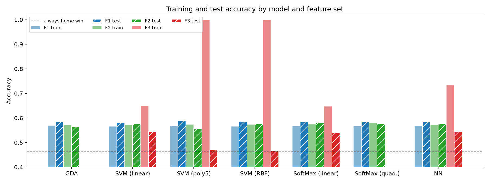

# EPL Match Prediction with Meta Statistics

UE24CS352A Machine Learning mini-project (Sem 5, Section K, Team 12, problem statement 69).

Team: PES1UG24CS922, PES1UG24CS643

## Problem statement

Reproduce the Stanford CS229 (Autumn 2019) project
[Gaining a Statistical Edge in Soccer Prediction using Machine Learning: Role of Meta Statistics in Match Prediction](https://cs229.stanford.edu/proj2019aut/data/assignment_308832_raw/26414102.pdf)
by Varun Harbola and Kyuho Lee.

The task is three-class classification of English Premier League matches
(home win / draw / home loss) from squad ratings known before kick-off.

## What the paper does

- **Data:** 3,800 EPL matches, seasons 2009/10 to 2018/19, scraped from whoscored.com.
- **Feature sets:**
  - F1: home and away average roster rating
  - F2: F1 plus average rating by position (attack, midfield, defence, goalkeeper)
  - F3: per-player rating, pass success %, passes, shots, key passes, blocks and interceptions per game
- **Models:** GDA, SVM (linear, degree-5 polynomial, RBF), softmax regression (linear, quadratic features), one-hidden-layer neural network.
- **Split:** random 80/20.
- **Headline result:** 58.89% test accuracy (degree-5 polynomial SVM on F1), against 46.19% for always predicting a home win.

## Setup and run

```bash
python -m venv .venv
.venv\Scripts\activate
pip install -r requirements.txt
python src/build_features.py
python src/run_experiments.py
```

`build_features.py` turns the raw files into `data/processed/matches.csv`. `run_experiments.py`
trains every model on F1, F2 and F3 and writes `results/results.csv` and `results/accuracy.png`.
A full run takes about a minute.

## Repository layout

| Path                             | Contents                                                              |
| -------------------------------- | --------------------------------------------------------------------- |
| `src/build_features.py`          | Builds F1, F2 and F3 from the raw rosters, lineups and results        |
| `src/run_experiments.py`         | Splits the data, trains all models, writes the results table and plot |
| `src/gda.py`                     | Gaussian discriminant analysis written by hand                        |
| `src/experiment_utils.py`        | Shared helpers for the extra experiments                              |
| `src/analysis.py`                | Confusion matrices and per-class precision/recall                     |
| `src/tune_svm.py`                | Cross-validated tuning of the polynomial SVM                          |
| `src/multi_seed.py`              | Mean and std of test accuracy over 10 random splits                   |
| `src/class_weight_experiment.py` | Balanced class weights and draw prediction                            |
| `data/raw/`                      | Per-season rosters, lineups and match results                         |
| `data/processed/matches.csv`     | One row per match: season, teams, score, label and all features       |
| `results/`                       | Output of the latest run                                              |
| `per.pdf`                        | The paper                                                             |

## Data

The raw files in `data/raw/` come from the authors' repository,
[varunharbola/EPL_match_prediction](https://github.com/varunharbola/EPL_match_prediction),
which they scraped from whoscored.com. We did not redo the scraping. Everything after that
(features, split, models) is our own code.

There are 3,791 matches with both a lineup and a result (the paper states 3,800):
46.19% home wins, 24.80% draws, 29.02% home losses. Labels are 1, 0 and -1.

## How we build the features

- Only the **starting eleven** of each team is used. Substitutes and minutes played are in the
  raw lineups but are not known before kick-off, so they are left out.
- Each player's statistics are that player's season averages from the roster file of the same season.
- **F1** (2 features): mean rating of the home eleven and of the away eleven.
- **F2** (10 features): F1 plus the mean rating of the goalkeeper, defenders, midfielders and
  forwards of each team.
- **F3** (154 features): rating, pass success %, passes, shots, key passes, blocks and
  interceptions per game for each of the 22 starters, in lineup order.
- A starter missing from the roster file gets the team's season average.

## Method

- One random 80/20 split, stratified by outcome, with a fixed seed (3,032 train, 759 test).
- All models except GDA get standardised inputs, with the scaler fitted on the training set.
- SVMs and SoftMax use scikit-learn defaults. The neural network has one hidden layer, and the
  number of hidden nodes (4, 8 or 16) is chosen by 5-fold cross-validation on the training set.
- No hyperparameters have been tuned yet.

## Results

Test accuracy on the 759 held-out matches; training accuracy and per-class recall are in
`results/results.csv`.

| Model                     | F1         | F2     | F3                           |
| ------------------------- | ---------- | ------ | ---------------------------- |
| GDA                       | 57.05%     | 53.62% | failed (singular covariance) |
| SVM (linear)              | 56.92%     | 57.31% | 53.23%                       |
| SVM (degree-5 polynomial) | 52.04%     | 52.04% | 49.01%                       |
| SVM (RBF)                 | 56.65%     | 55.73% | 55.60%                       |
| SoftMax (linear)          | 56.79%     | 56.92% | 53.49%                       |
| SoftMax (quadratic)       | **57.44%** | 54.28% | not run                      |
| Neural network            | **57.44%** | 57.05% | 53.75%                       |



- Best test accuracy is 57.44% on F1, against the paper's 58.89% and the always-home-win
  baseline of 46.19%.
- On F1 no model predicts draws: draw recall is 0% for every model.
- On F3 training accuracy rises (up to 78% for the RBF SVM) while test accuracy falls, the same
  overfitting pattern the paper reports.
- The degree-5 polynomial SVM is the weakest model here, unlike in the paper. It runs with
  scikit-learn's default `coef0=0` on standardised inputs and has not been tuned.
- GDA fails on F3 because the class covariance matrices are singular, as in the paper.
- SoftMax with quadratic features on F3 is not run; the paper also stopped it.

## Extra experiments

Added after the base reproduction. Run each from the repository root after
`python src/build_features.py`. They share helpers in `src/experiment_utils.py`.

| Script                           | What it does                                                             | Output                                                            |
| -------------------------------- | ------------------------------------------------------------------------ | ----------------------------------------------------------------- |
| `src/analysis.py`                | Confusion matrices and per-class precision/recall (seed 0)               | `results/per_class_metrics.csv`, `results/confusion_matrices.png` |
| `src/tune_svm.py`                | 5-fold CV grid search for the polynomial SVM on F1 and F2 (about 10 min) | `results/tune_svm.csv`                                            |
| `src/class_weight_experiment.py` | Compares `class_weight` none vs balanced for draw prediction             | `results/class_weight.csv`                                        |
| `src/multi_seed.py`              | Repeats the 80/20 split over 10 seeds, reports mean and std              | `results/multi_seed.csv`, `results/multi_seed.png`                |

### Test accuracy over 10 random splits (mean +/- std)

| Model                     | F1             | F2             | F3             |
| ------------------------- | -------------- | -------------- | -------------- |
| GDA                       | 56.21 +/- 1.35 | 54.15 +/- 0.66 | failed         |
| SVM (linear)              | 56.35 +/- 1.32 | 56.30 +/- 1.13 | 52.98 +/- 1.27 |
| SVM (degree-5 polynomial) | 51.82 +/- 0.81 | 51.09 +/- 0.75 | 48.87 +/- 0.63 |
| SVM (RBF)                 | 55.92 +/- 1.27 | 55.42 +/- 1.36 | 55.11 +/- 0.98 |
| SoftMax (linear)          | 56.35 +/- 1.48 | 56.14 +/- 1.23 | 53.44 +/- 0.91 |
| SoftMax (quadratic)       | 56.47 +/- 1.45 | 55.06 +/- 1.16 | not run        |
| Neural network            | 56.35 +/- 1.51 | 55.64 +/- 1.19 | 53.65 +/- 0.79 |

- Across splits the F1 models (apart from the untuned polynomial SVM) lie within about 0.6
  points of each other, less than the split-to-split std, so no model is clearly best.
  The 57.44% in the table above is the seed-0 split; the paper's 58.89% is also a single split.
- Tuning the polynomial SVM (seed 0, CV on the training set only) raises F1 test accuracy
  from 52.04% to 57.05% and F2 from 52.04% to 55.60%. The best settings use `coef0=1`
  and `C=0.1`, which supports the earlier guess that the default `coef0=0` was the cause.
  The tuned model still predicts no draws.
- `class_weight="balanced"` lifts draw recall from about 0% to 28-44% on F1 and F2, but
  draw precision is only about 30% and test accuracy falls by 2-5 points.

## Known limitations

- Player ratings are season averages, so they include the match being predicted.
- The split is random across seasons rather than chronological.
